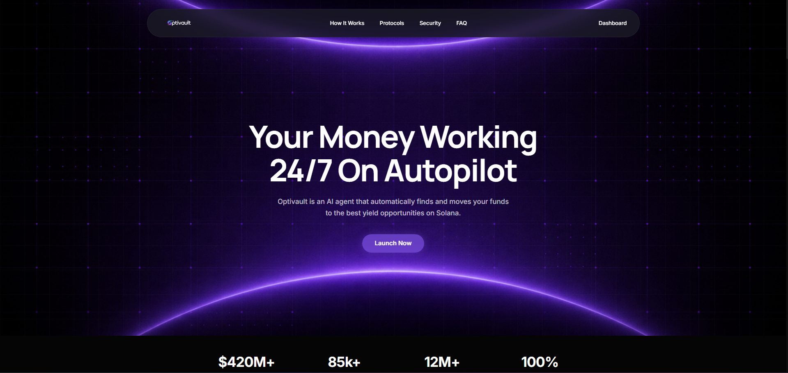
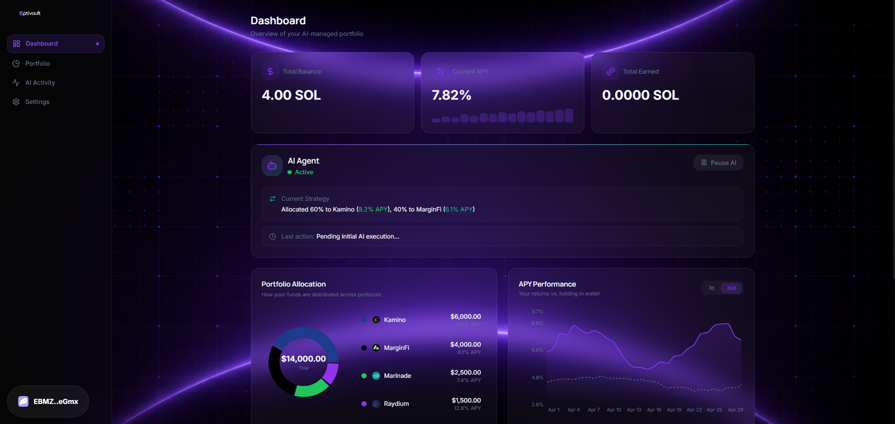

<p align="center">
  
  
</p>

<p align="center">
  <a href="https://solana.com/"></a>
  <a href="https://www.rust-lang.org/"></a>
  <a href="https://nextjs.org/"></a>
  <a href="https://nodejs.org/"></a>
</p>

<p align="center">
  <strong>Optivault</strong> is an intelligent, non-custodial yield aggregator on the Solana blockchain where you can deposit your assets, select a personalized risk profile, and let an automated AI Agent dynamically rebalance your portfolio.
</p>

---

## ✨ Features

| Feature                      | Description                                                                                          |
| ---------------------------- | ---------------------------------------------------------------------------------------------------- |
| 🏦 **Personalized Vaults**   | Define your time horizon and set your risk appetite (Conservative, Balanced, Aggressive).            |
| 🤖 **AI-Driven Rebalancing** | An off-chain analyzer continuously monitors protocol APYs, liquidity, and risk metrics.              |
| 🔒 **On-chain Security**     | Funds are secured on-chain via our Rust-based Anchor program in user-specific PDAs.                  |
| ⚡ **Automated Execution**   | The AI agent automatically fires signed rebalance transactions to capture the highest safe yields.   |
| 🌐 **Zero-Friction UI**      | A seamless Next.js frontend with robust wallet integration for tracking performance and allocations. |

---

## 🏗️ Architecture

```
Optivault/
├── 📁 agent/                     # Off-chain AI Rebalancer
│   ├── 📁 src/                   # Node.js Agent logic
│   │   ├── analyzer.ts           # Rebalance decision engine
│   │   ├── config.ts             # Protocol configurations
│   │   ├── executor.ts           # Transaction execution
│   │   ├── monitor.ts            # APY and liquidity monitoring
│   │   └── index.ts              # Agent entry point
│   └── package.json
├── 📁 app/                       # Frontend UI
│   ├── 📁 src/
│   │   ├── 📁 app/               # Next.js App Router pages
│   │   ├── 📁 components/        # UI components (Dashboard, Setup)
│   │   ├── 📁 hooks/             # Custom Solana hooks
│   │   └── 📁 lib/               # Utility functions & Anchor IDL
│   └── package.json
├── 📁 assets/                    # Project assets (banners)
└── 📁 optivault/                 # Smart Contract
    ├── 📁 programs/optivault/    # Anchor Program
    │   └── 📁 src/
    │       ├── 📁 instructions/  # Deposit, Withdraw, Rebalance logic
    │       ├── 📁 state/         # PDA states
    │       ├── errors.rs         # Custom program errors
    │       └── lib.rs            # Program entry point
    └── Anchor.toml               # Anchor workspace config
```

---

## 🔗 Smart Contracts (Anchor Program)

### `optivault`

> Core Anchor program managing user deposits, risk profiles, and rebalancing constraints.

| Function                               | Access           | Description                                                   |
| -------------------------------------- | ---------------- | ------------------------------------------------------------- |
| `initialize(risk_level, time_horizon)` | User             | Initialize a new user vault with specific risk settings       |
| `deposit(amount)`                      | User             | Deposit tokens into the user's vault PDA                      |
| `withdraw(amount)`                     | User             | Withdraw tokens from the vault                                |
| `rebalance(target_protocol, amount)`   | Authorized Agent | AI agent executes optimal yield routing based on risk profile |

- **State Management**: Stores `risk_level` and `time_horizon` on-chain.
- **Security**: Strict access controls ensuring only authorized agent can rebalance, while only the user can withdraw.

---

## 🖥️ Tech Stack

### Smart Contract / Blockchain

| Tool                                   | Purpose                         |
| -------------------------------------- | ------------------------------- |
| [Solana](https://solana.com/)          | High-performance blockchain     |
| [Anchor](https://www.anchor-lang.com/) | Solana smart contract framework |
| [Rust](https://www.rust-lang.org/)     | Smart contract language         |

### Frontend UI

| Tool                                          | Purpose                              |
| --------------------------------------------- | ------------------------------------ |
| [Next.js](https://nextjs.org/)                | React framework for web applications |
| [Tailwind CSS](https://tailwindcss.com/)      | Utility-first styling                |
| [@solana/wallet-adapter](https://solana.com/) | Wallet connection UI                 |

### AI Agent

| Tool                                          | Purpose               |
| --------------------------------------------- | --------------------- |
| [Node.js](https://nodejs.org/)                | Runtime environment   |
| [TypeScript](https://www.typescriptlang.org/) | Type-safe execution   |
| [@solana/web3.js](https://solana.com/)        | On-chain interactions |

---

## 🚀 Getting Started

### Prerequisites

Make sure you have the following installed:

- [Node.js](https://nodejs.org/en/) **v18+**
- Yarn / npm
- [Rust](https://www.rust-lang.org/tools/install) & [Solana CLI](https://docs.solana.com/cli/install-solana-cli-tools)
- [Anchor CLI (`avm`)](https://www.anchor-lang.com/docs/installation)

---

### 1. Smart Contract Deployment

```bash
cd optivault
```

**Install dependencies:**

```bash
yarn install
```

**Build the Anchor program:**

```bash
anchor build
```

**Deploy to localnet or devnet:**

```bash
anchor deploy
```

---

### 2. Frontend Setup

```bash
cd app
```

**Install dependencies:**

```bash
npm install
```

**Start the development server:**

```bash
npm run dev
```

Open your browser and navigate to **[http://localhost:3000](http://localhost:3000)** 🎉

---

### 3. Run the AI Agent

```bash
cd agent
```

**Install dependencies:**

```bash
npm install
```

**Configure environment variables:**

Create a `.env` file in `agent/` and add your RPC URL and agent keypair config:

```bash
cp .env.example .env
```

**Start the monitoring and execution agent:**

```bash
npm start
```

---

## 🤖 How It Works

```
1. User connects wallet and initializes a Vault via the UI
      ↓ (Risk level and time horizon stored in PDA)

2. User deposits assets into our Smart Contract
      ↓ (Funds secured in a protocol-controlled vault)

3. Off-chain AI Agent constantly monitors DeFi protocols (Kamino, MarginFi)
      ↓ (Analyzes APY, Liquidity, checks against user risk profile)

4. Agent computes the optimal allocation for yield
      ↓ (Simulates potential improvements)

5. Agent triggers the `rebalance` instruction on-chain
      ↓ (Smart Contract verifies agent signature and executes transfer)

6. User's portfolio grows automatically
```

---

## 🛡️ Security Considerations

- **Non-Custodial Design**: The AI Agent can only rebalance funds across approved protocols; it **cannot** withdraw user funds.
- **On-Chain Risk Enforcement**: The Anchor program enforces limits preventing aggressive moves for conservative profiles.
- **PDA Architecture**: User balances are securely isolated using Program Derived Addresses.

---

## 📊 Risk Profiles

| Level           | Strategy                                | Allowed Protocols       |
| --------------- | --------------------------------------- | ----------------------- |
| 🟢 Conservative | Low volatility, steady reliable yield   | Kamino, MarginFi        |
| 🟡 Balanced     | Moderate risk over medium timeframe     | Kamino, MarginFi, Drift |
| 🔴 Aggressive   | High yield optimization, frequent moves | All supported protocols |

---

## 🏆 Hackathon Submission Details

**Track:** DeFi  
**Live Demo:** _(Add your link here)_  
**Video Presentation:** _(Add your link here)_

---

<p align="center">
  Made with 🩵 by the Optivault Team · <em>Built for the Solana Ecosystem.</em>
</p>
